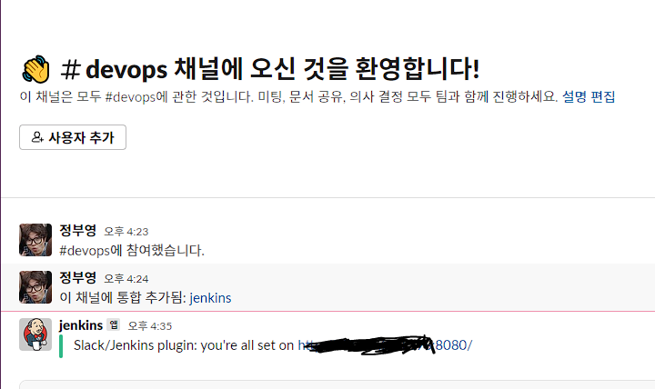
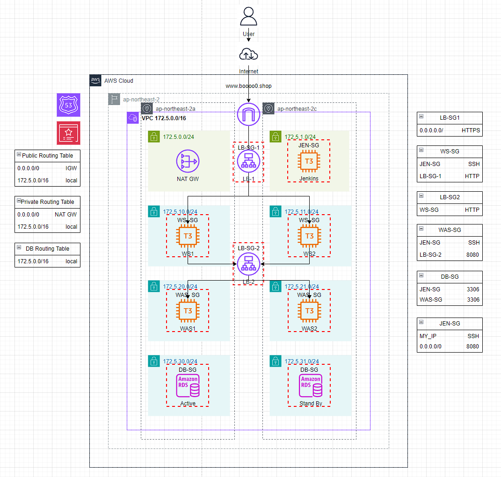

# Architecture

- Terraform을 사용해서 VPC 환경에서의 클라우드 인프라를 프로비저닝하고 Jenkins와 Ansible로 서로 데이터를 주고 받는 React앱과 Spring Boot앱의 CI/CD 파이프라인을 구축합니다.

## 사용 기술

- Terraform v1.4.4
- Jenkins v2.401.3
- Ansible v2.9.27
- React v18.2.15
- Node.js v18.16.0
- tailwind v3.4.1
- Spring Boot v3.1.7
- JPA
- QueryDsl v5.0.0
- Lombok
- Java v17.0.7
- MariaDB v10.11.6

<details><summary>v1.0~v1.1</summary>
<div markdown="1">

- 

## Infrastructure

- 지급받은 크레딧을 활용해 네이버 클라우드 플랫폼에 유료 서비스를 포함한 인프라를 구축했습니다.

- 각 서버의 사양은 동일하게 2xCPU, RAM 8GB, SSD 50GB 운영체제는 CentOS 7.3으로 구성했습니다.

- VPC 환경에서 바스티온 호스트 겸 WS를 퍼블릭 서브넷에 생성하고 같은 서브넷에 CI/CD를 담당할 Jenkins 서버를 생성합니다.

- WAS와 DB를 숨기기 위해 프라이빗 서브넷에 서버를 생성하고 또다른 퍼블릭 서브넷에 생성한 NAT Gateway를 통해 패키지의 설치 등 인터넷이 필요한 경우 인터넷을 사용합니다.

- NAT Gateway는 전용 서브넷을 별도로 생성해야 하기 때문에 퍼블릭 서브넷을 하나 더 생성했습니다.

### ACL Rule, ACG

- 네이버 클라우드 플랫폼은 VPC 환경으로 인프라를 구축할 경우 ACL Rule을 각 서브넷에 반드시 적용해야 합니다.

#### 퍼블릭 서브넷

- 퍼블릭 서브넷은 인터넷을 통한 http, https 접속을 허용하고 로컬 ip로 부터 SSH 접속을 허용합니다. 그리고 인터넷을 통한 젠킨스 접속을 위해 젠킨스의 8080 포트도 접속을 허용합니다.

- 프라이빗 서브넷과의 통신을 위해 아웃바운드 룰은 http, https, SSH 뿐만 아니라 WAS가 실행 될 프라이빗 서브넷의 8080 포트도 허용합니다.

#### 프라이빗 서브넷

- 퍼블릭 서브넷으로부터 SSH를 허용하고 클라이언트와 통신하기 위한 8080 포트도 접속을 허용합니다.

- 아웃바운드 룰은 모든 호스트를 대상으로 모든 포트를 허용해두었습니다.

### ACG

- 각 서브넷에 ACL Rule을 적용한 이후에도 각 서버에 ACG를 맵핑해줘야 합니다. 맵핑된 ACG는 http, https, SSH, 8080 포트를 허용합니다.

## Frontend

- 리액트 라이브러리를 사용해서 구현했습니다.

- 입력받은 텍스트는 state로 저장되고 제출 시 값은 JSON 포맷으로 서버에 전달되어 DB에 저장됩니다.

- 조회 기능은 DB에서 모든 텍스트를 axios를 사용해 배열로 호출한 다음 map 함수를 사용해서 li 태그로 렌더링합니다.

## Backend

- 스프링 부트 프레임워크를 사용해서 구현했습니다.

- JPA를 사용해서 Content 객체와 content 테이블을 맵핑해서 객체를 Entity로서의 역할을 하게 했습니다. 클라이언트로부터 입력받은 텍스트는 JSON 포맷으로 넘어오기 때문에 RequestBody 어노테이션을 사용해서 전달받은 후 DB에 저장합니다.

- 조회 기능은 text 열의 모든 항목을 조회해서 리스트로 만든 후 응답으로 반환합니다.

## CI/CD

- Jenkins에서 파이프라인을 생성하고 레포지토리에 업로드된 Jenkinsfile에 명시된 작업을 수행하게 합니다.

- 이 과정에서 배포 자동화를 위해 Ansible 스크립트를 사용해서 퍼블릭 서버와 프라이빗 서버에 명령을 내립니다.

- 빌드된 아티팩트를 서버에 전달하기 위해 네이버 클라우드 플랫폼의 오브젝트 스토리지에 업로드하고 Ansible 스크립트를 통해 다운로드 받습니다.

- 오브젝트 스토리지를 CLI에서 접근하기 위해서는 AWS CLI가 필요합니다. `--endpoint-url=https://kr.object.ncloudstorage.com` 옵션을 사용해 오브젝트 스토리지에 접근합니다.

- 이것을 Jenkins가 수행하기 위해서는 Jenkins에 `AWS_ACCESS_KEY_ID`, `AWS_SECRET_ACCESS_KEY` 환경 변수를 생성해서 Key를 저장해두어야 합니다.

### 프론트엔드

- 프론트엔드는 `npm install`을 통해 필요한 모듈들을 설치한 후 `npm build`로 빌드를 합니다.

- 빌드 후 `dist` 디렉토리에 있는 아티팩트를 압축하여 오브젝트 스토리지에 업로드합니다.

- Ansible 스크립트는 프론트엔드 서버에 아티팩트를 다운로드해서 CentOS에서 Nginx의 홈 디렉토리인 `/usr/share/nginx/html`에 빌드된 아티팩트를 배포합니다.

### 백엔드

- 스프링부트 앱을 빌드하기 위해서 Jenkins 서버에 스프링부트 버전에 대응되는 Java17이 설치되어 있어야 하고 Gradle이 설치되어 있어야 합니다.

- `gradlew`를 실행시키기 위해 권한을 변경하고 `./gradlew build`를 통해 빌드를 합니다.

- 빌드 후 생성된 jar 파일을 오브젝트 스토리지에 업로드합니다.

- Ansible 스크립트를 통해 jar 파일을 다운로드 받고 이전에 스프링부트 앱이 실행될 포트에 실행중인 프로세스가 있다면 다음과 같은 셸 스크립트를 사용해서 프로세스를 종료하고 새로 다운로드 받은 jar 파일을 실행합니다.

- 

- `lsof -i :8080 | awk '{print $2} | sed -n '2p'`를 통해 8080 포트에서 실행중인 프로세스의 PID를 가져오고 추가 모드 리디렉션을 통해 pid.txt의 마지막 줄에 PID를 추가합니다.

- `tail -1 pid.txt`를 통해 `pid.txt`의 마지막 줄에 저장된 PID를 환경 변수 `SERVER_PID`에 할당합니다.

- `SERVER_PID`를 호출하고 `kill`명령어를 사용해 실행중인 프로세스를 종료합니다.

- 새로운 jar 파일을 `nohup &` 명령어를 사용해 백그라운드로 실행되게 합니다.

- **_여기서 Ansible은 멱등성을 가지기 때문에 실행까지만 한다면 결과가 달라지지 않는다고 판단해서 위 과정을 제대로 수행하지 못합니다. 그렇기 때문에 SERVER_PID를 출력하도록 해서 이전과 다른 결과를 내는 TASK로 인식하게 해서 배포가 원활히 이루어지도록 합니다._**

### Jenkins

- 리액트 앱 빌드를 위해 필요한 NodeJS 플러그인과 깃허브에 PUSH가 되었을 때 파이프라인이 동작할 수 있도록 Github Integration 플러그인을 설치합니다.

- 

- 깃허브 레포지토리 접근 권한을 얻기 위해 레포지토리 접근 권한을 가진 토큰을 생성해 Jenkins의 Credential에 등록합니다.

- 

- 깃허브 레포지토리에 PUSH되는 항목을 자동 빌드할 수 있도록 파이프라인을 생성할 때 빌드 트리거 항목에 `Github hook trigger for GITScm polling` 항목을 체크합니다.

- 

- Github Webhook에 `http://[Jenkins 서버 ip]:[Jenkins 포트]/github-webhook/`와 같이 젠킨스 서버를 등록합니다.

- 파이프라인에 Jenkinsfile의 위치와 브랜치 명을 명시합니다.

- 이제 명시한 브랜치에 PUSH가 이루어지면 배포 자동화 파이프라인이 동작합니다.

- CentOS 7.3에서 `ca-certificates`가 원인인 듯한 젠킨스 레포 등록 에러가 있었는데 CentOS 7.8에서는 에러가 나지 않는 것으로 보아 리눅스 디스트로 버전에 따른 차이가 있는 듯 하다. 그리고 CentOS 7.x에 대한 Jenkins의 지원이 곧 끝나기 때문에 이제는 CentOS 8.x 버전으로 서버를 생성하는 것이 좋을 것 같다.

#### Slack Notification

- Jenkins 파이프라인이 동작할 때 Slack에 메세지를 보냅니다.

- Slack Apps에서 `Jenkins CI` 플러그인을 설치하고 Jenkins에서 Slack Notification 플러그인을 설치합니다.

- Slack에서 발급된 토큰으로 Jenkins Credential을 Github 토큰과 마찬가지로 등록합니다. 이 때 Credential의 종류는 Secret Text입니다.

- Jenkins 관리 -> 설정에서 Slack 항목에 Slack 워크스페이스의 서브 도메인과 토큰을 사용해 연결합니다.

- 

- 

- 위와 같이 연결 테스트를 통해 연결을 확인할 수 있습니다.

- 마지막으로 Jenkinsfile에 각 배포 자동화 단계별로 slackSend 항목에 메세지를 보낼 채널, 메세지를 정의합니다.

- 

# 되돌아보며

<details><summary>Architecture</summary>
<div markdown="1">

- 이 레포지토리의 이름을 Architecture라고 지은 것도 목적이 아키텍처의 단계적인 확장이여서 그렇게 지었다. 하지만 후술할 문제들로 인해서 지속적인 확장을 할 수 없게 되었다.

- 지금의 아키텍처도 모두 퍼블릭 서브넷에 퍼블릭 서버로만 생성하던 것보다는 보안 측면에서 더 좋은 방향으로 발전한 것이지만 그래도 목표를 더 높게 잡아서 아쉬움이 많이 남는다.

- 

- 원래 목표로 했던 아키텍처이다. 지금의 형태에서 DB 서버를 따로 분리하는 것, slave DB 서버를 추가하는 것, 백엔드 서버를 추가로 생성하고 로드밸런서를 생성해서 연결하는 것으로 단계적인 확장을 생각했었다.

- 아키텍처 자체에 대해 이전과 다르게 생각하게 된 점이 있다.

- 일반적으로 알려진 모범 사례와 같은 아키텍처가 현업에서 반드시 구축되고 그것에 기반한 서비스가 운영되지는 않는다는 것을 알게 되었기 떄문이다.

- 아키텍처도 결국 요구사항에 맞게 구성되는 것이며 회사마다 심지어 같은 회사일지라도 팀마다 다르다.

- 프론트엔드, 백엔드, 데이터베이스를 한 서버에 배포하고 서버를 여러개 운영하는 곳, 프론트엔드와 BFF를 하나의 서버에 배포하고 스프링 클라우드를 사용해서 API 게이트웨이를 생성해 클라이언트와 통신하면서 마이크로 서비스를 프라이빗으로 숨기는 곳 등 학교 동기들에게 물어보면서 알게 되었다.

- 

- 엔지니어링도 개발과 마찬가지로 결국 대응인 것 같다. 상황에 맞게 요구사항에 맞게 필요한 아키텍처를 사용하는 것이 중요한 것 아닐까

<div>
</details>

<details><summary>CI/CD</summary>
<div markdown="1">

- 리액트 앱의 CI/CD는 이전에도 해본 것이기 때문에 큰 문제가 없었다. 아니 문제가 있긴 했다.

- 문제는 바로 `package.json`의 경로였다. Jenkins는 파이프라인과 연결된 브랜치를 있는 그대로 workspace에 복사해온다. 그럼 client 디렉토리 안에 `package.json`이 있고 Jenkins는 그 밖에서 `npm install`을 수행하는데 이 문제를 어떻게 해결해야 할 지 처음엔 몰라서 deploy 브랜치를 따로 생성하고 소스코드를 밖으로 꺼내서 PUSH를 했다.

- 마무리를 하기로 마음을 먹은 이후에 알게된 것이지만 `--prefix` 옵션을 통해 `npm` 명령어를 수행할 경로를 지정할 수가 있었다.

- 그렇게 하면 개발자들이 개발을 진행하는 디렉토리 구조 그대로 유지하면서 main 브랜치를 통해 CI/CD 파이프라인을 구축할 수 있다.

- 진짜 문제는 스프링 부트 앱의 CI/CD 였다. 사실 문제라기보다 처음 시도해보는 것이였고 이전 리액트 앱 CI/CD는 정말 최고의 훌륭한 선생님으로부터 배울 수 있었지만 스프링 앱은 좋은 예시를 알 수 없기 때문에 이렇게 하면 될 것이다 라는 추측과 안되는 상황을 해결하기 위한 대응의 연속이었다.

- 리액트 앱과 마찬가지로 빌드 명령을 수행할 때 경로의 문제가 있었다. 그리고 이렇게 하는 것이 맞나? 라는 생각이 가장 강하게 들었던 부분은 JPA에 명시된 데이터베이스 URL에 Entity에 해당하는 테이블이 있어야 빌드가 되기 때문에 Jenkins 서버에 MySQL을 설치하고 똑같은 스키마를 가진 테이블을 생성한 다음 빌드를 했다.

- 데이터베이스 URL을 백엔드 서버에 있는 데이터베이스로 하면 되지 않나 생각했지만 인식을 하지 못했고 이 부분은 후술할 퍼블릭 서버와 프라이빗 서버 간 통신에 대해 아직 명확하게 알지 못하기 떄문에 문제가 무엇인지 어떻게 했어야 하는지 경로 문제와 마찬가지로 제발 누가 알려줬으면 좋겠다는 마음이 간절하다.

<div>
</details>

<details><summary>IaC</summary>
<div markdown="1">

- 사실 인프라의 확장을 포기하게 된 가장 큰 이유가 바로 Terraform이다.

- Terraform state의 유실을 간과하고 git checkout을 반복하며 프론트엔드와 백엔드 코드를 수정하다보니 이미 Terraform은 생성된 리소스들의 정체를 잊어버렸다.

- 처음 Terraform 강의를 들을 때 가장 강조되었던 것이 Terraform backend였는데 활용 방법에만 집중해서 이런 상황이 생기지 않았나 싶다.

- 만약 Terraform만이라도 WSL 우분투에서 진행해서 리소스를 계속 인식할 수 있게 되었더라면 혹은 도커 컨테이너 내에서 작업을 했다면 이런 상황을 피할 수 있었을텐데 아쉬움이 많이 남는다.

- 이 부분도 마무리하면서 찾아보니 state 파일을 서로 공유하고 인프라를 계속 프로비저닝 할 수 있게 S3 버킷과 같은 원격 저장소에 업로드해서 공유하는 방식을 채택한다고 한다.

- 어떤 리소스를 추가했는지 아니면 수정했는지에 따라 깃 브랜치 전략에서 feature를 세분화해서 브랜치를 생성하듯이 각 state 파일을 업로드해서 관리를 하는 것 같다.

- ```
  terraform {
    backend "s3" {
        bucket         = "tf101-apne2-tfstate"
        key            = "terraform101/iam/terraform.tfstate"
        region         = "ap-northeast-2"
        encrypt        = true
        dynamodb_table = "terraform-lock"
    }
  }
  ```

- state의 유실은 만약 내가 실제 프로젝트를 운영 중에 일어났다면 아찔했을 것 같다. 그래도 큰 실수를 통해 나아가야할 방향을 알게 되었다면 오히려 더 좋은 일이라고 생각한다.

<div>
</details>

<details><summary>Automation</summary>
<div markdown="1">

- 이번에 가장 절실히 중요성을 꺠달은 부분이 자동화이다. 처음 CI/CD를 구축할 때 서버를 생성하고 Nginx의 설치나 Jenkins의 설치를 Ansible 스크립트를 통해 하는 이유를 알지 못했다.

- 중요성을 깨달았던 이유는 CI/CD 파이프라인 구축이 완료되어가던 시점에 Jenkins 서버를 통째로 날렸기 때문이다.

- 이유는 이전에 Ansible을 설치할 때 pip를 사용해서 설치를 했고 CentOS에 기본으로 설치된 파이썬 2.7버전과 pip로는 Ansible을 설치할 수 없어서 파이썬 3.x 버전을 설치해서 Ansible을 설치했다.

- 비슷한 사례를 많이 봤는데 이렇게 하면 yum이 에러가 발생한다. 파이썬의 버전 문제 때문이다.

- yum으로 MySQL을 설치하려다가 에러가 발생했고 실수로 yum을 삭제하는 대참사가 일어난다. rpm으로 MySQL을 설치하거나 yum을 설치하거나 하려고 했으나 설치하는 방법도 찾을 수가 없었다.

- 결국 눈물을 머금고 Jenkins 서버를 새로 구성하기로 결심했는데 이 때 내가 서버를 구성하는 Ansible 스크립트를 가지고 있어서 자동화가 가능했다면 이런 상황에 대응할 수 있었겠다는 생각이 들었다.

- 이것을 더 확장시키면 프로젝트가 진행되면서 추가로 서버를 구성해야할 때도 서버를 생성하고 그 서버에 접속해서 하나하나 설치를 하는 것보다 Terraform도 재사용 가능하도록 코드를 작성하고 생성된 서버에 필요한 구성을 자동화 스크립트를 통해 빠르게 진행하는 것이 내가 해야할 업무인 것이다.

- 이것이 자동화의 의의이며 자동화 스크립트는 서버를 다시 구성해야 하는 문제가 발생했을 때 내가 대응할 수 있는 자산이라고 생각했다.

- 그동안 코드를 웬만해서는 재사용하지 않고 0부터 다시를 스스로 강조했다. 이유는 생각을 많이 하고 이전에는 보이지 않았던 것을 찾아내기 위해서이다.

- 이제는 재사용 가능한 코드의 중요성을 생각하면서 밸런스를 맞춰야 할 것 같다.

- ```yaml
  - name: "Create Jenkins Server"
    gather_facts: false
    hosts: all
    become: true
    tasks:
        - name: "yum update"
            yum:
                name: '*'
                state: latest
        - name: "Install epel-release and Java for Jenkins"
            yum:
                name:
                  - epel-release
                  - java-11-openjdk
                state: present
        - name: "wget Jenkins repo"
            shell:
                cmd: "wget -O /etc/yum.repos.d/jenkins.repo https://pkg.jenkins.io/redhat-stable/jenkins.repo"
        - name: "import Jenkins repo key"
            shell:
                cmd: "rpm --import https://pkg.jenkins.io/redhat-stable/jenkins.io.key"
        - name: "Install Jenkins"
            yum:
                name: jenkins
                state: present
        - name: "Start Jenkins"
            shell:
                cmd: "systemctl start jenkins"
  ```
- Jenkins 서버 구성을 위한 스크립트는 위와 같이 작성할 수 있을 것이다. 하지만 아직 빌드를 위한 Java17 설치와 gradle의 설치 그리고 gradle home의 환경변수 등록 스크립트를 어떻게 자동으로 실행시킬 것인지 또한 방법을 계속 찾아봐야 한다.

- 앞으로 계속 인프라를 구축하고 CI/CD를 구축하고 개발을 진행할 것이기 때문에 Jenkins 외에 다른 서버 구성들 또한 스크립트를 통해 자동화할 수 있도록 개선할 생각이다.

- 이 부분을 Ansible이 아닌 Terraform을 통해서 대신할 수 있는 듯 하다. 위에서 문제점으로 생각했던 서버를 생성할 때 그 서버에 설정을 하기 위한 스크립트를 실행시키도록 할 때 Ansible을 사용하면 전달의 방법이 떠오르지 않았는데 Terraform의 provisioner를 사용해서 AWS configure 등의 작업을 수행할 수 있을 것 같다.

<div>
</details>

<details><summary>Why Docker?</summary>
<div markdown="1">

- 도커를 사용해야 할 이유는 차고 넘친다. 그리고 절실히 느끼기도 했다.

- 위에서 서술한 바와 같이 나는 자동화를 통해 일관된 결과를 발생시켜야 한다. 도커는 그 역할을 수행하기에 최적의 기술이다. 도커를 사용하면 도커 이미지가 미리 준비되어 있으니 일관된 결과를 효율적으로 만들어낼 수 있다.

- 왜 도커를 사용하는지 도커를 사용하면 좋은 점이 무엇인지 직접 느끼고 깨달았다는 점도 아주 큰 수확이다. 앞으로의 방향을 정하는 데에 도움이 되었기 때문이다.

<div>
</details>

<details><summary>Nginx</summary>
<div markdown="1">

- 가장 괴롭게 만들었던 것이 Nginx Reverse Proxy이다.

- 구글링으로 해결이 되지 않아서 현업에 있는 대학 동기들과 다른 현업 개발자들에게 자문을 구했다. 일단 논리는 간단하다.

- 퍼블릭 서버에서 리액트 앱은 요청을 자신이 동작하는 ip와 포트로 요청을 보낸다.

- Nginx는 해당 포트로 오는 요청을 프라이빗 서버의 스프링 부트 앱이 실행중인 포트로 보낸다.

- 하지만 Nginx의 configure 파일들을 수정하고 재시작하면 Nginx가 실행되지 않는 오류가 계속 발생했다.

- `journalctl -xe` 명령어로 오류를 확인하더라도 어떤 문제인지 왜 오류가 나는지 알 수가 없으니 이후에 내가 맡아야 할 업무에 이런 오류를 해결하는 트러블 슈팅도 포함되어 있을텐데 나도 누가 해결해줬으면 하는 마음이였다.

- 하지만 Nginx를 배포에 사용하는 것 외에 활용하는 것도 이번이 처음이였으니 동작하는 방식 그리고 configure 하는 방법에 대해 앞으로 숙지하면 되는 것이다.

- 그리고 숙지한 이후에 Nginx의 configure 파일도 동작 결과를 미리 알고 작성해둔다면 WS를 더 빨리 구성해서 팀에 도움이 될 수 있을 것 같다.

- 인프라의 확장이 목적이지만 우선 앱이 잘 동작해야 하는데 이부분 때문에 해당 목적을 이루지 못한 점도 많이 아쉽다.

- 두 서버 간 통신을 Nginx를 통해 해결했어야 하는게 맞는지 코드의 문제인지 퍼블릭 서버와 프라이빗 서버의 통신에 있어서 근본적으로 불가능한 부분이 있는 것인지 모르겠다. 이 부분도 정말 누가 알려줬으면 하는 마음이 간절하다.

<div>

</details>

<details><summary>보안성</summary>
<div markdown="1">

- 프라이빗 서브넷을 구축하고 그 안에 DB와 WAS를 두려고 했던 것도 보안성 측면에서 더 나은 인프라를 구축하려고 한 것은 맞다.

- 그렇다고 보안을 크게 생각하고 한 것은 아니였다. 학교에서 네트워크 강의를 들을 때도 보안에 대한 내용은 항상 생략되었고 간과한 부분 중 하나이다.

- 

- 

- 퍼블릭 서버인 Jenkins 서버와 WS에 SSH 브루트포스 공격이 있었다. 실제로 서버를 공격할 의도로 일어난 것인지 알 수는 없지만 보안성의 향상에 대해 생각해보게 되는 좋은 일이였다.

- 이 문제에 대해 어떻게 해결할 수 있을까에 대한 해답은 우선 더이상 간단한 비밀번호를 사용하지 않는 것이다. 비밀번호가 복잡해서 사용이 불편하다면 SSH 키를 등록해서 비밀번호 없이 접속하면 된다.

- 그리고 서버 내에서 SSH 접속에 일정 횟수 이상 실패할 경우 접속을 차단하는 방법이 있다면 퍼블릭 서버를 보호하는 좋은 방법이 될 것 같다.

- 이외에도 인프라 전체의 보안에 대해 그리고 마지막 학기 정보보호와 보안 기초 수업에서 대표적인 공격과 그 대응 방법에 대해 숙지하고 적용할 수 있는 부분이 있는지 생각해보기로 했다.

<div>
</details>

<details><summary>버전 관리</summary>
<div markdown="1">

- 오픈 소스 수업에서 직접 Git Flow로 협업하는 연습을 하고 브랜치 관리를 많이 연습했다. 내가 잘 하고 싶은 부분이기도 했기 때문에 성실히 임했다.

- 그래서 어느정도 충분히 잘 이행할 수 있을 것이라고 생각했다. 하지만 예상치 못한 부분에서 수정이 필요할 경우 develop으로의 병합과 전체 버전 관리 상황에 대해 놓치게 되었다.

- 내가 수정할 부분에 대해 이런 브랜치를 이 브랜치의 이 부분을 기점으로 해야겠다 같은 생각을 오류가 발생한 상황에 침착하게 할 수 있어야 한다.

- 그리고 다른 공개 레포지토리들을 살펴봤다. 생각했던 것 보다 훨씬 더 많은 브랜치를 만들어서 협업을 하고 긴밀한 협업을 위해 생각 이상으로 전체 개발 상황에 대한 소통이 필요한 것 같다.

<div>
</details>

<details><summary>좋았던 점들</summary>
<div markdown="1">

- 첫번째로 좋은 점은 내가 어떤 엔지니어가 되어야 할 지에 대해 생각하게 된 점이다.

- 이전까지는 기술의 숙련, 문제 해결 능력과 대응 능력 그리고 컴퓨터 과학에 기반해서 생각할 수 있는 능력을 키우기 위한 과정에 집중했다면 이제는 그 능력을 어떤 방향으로 사용하고 더 키워나갈 것인지를 생각하게 된 것 같다.

- 희망하는 포지션을 확정했다는 말과 같은 것 같다.

- 조금 더 풀어서 이야기하면 프론트엔드 개발자를 목표로 시작해서 부족한 코딩 스킬과 컴퓨터 과학을 채우기 위해 희망 포지션을 완전히 지운 채로 공부를 하다가 내가 임하는 마음이 편하고 의욕이 더 생기는 분야를 찾게되고 그 분야의 멘토를 만나 더 확신을 가지고 그 포지션의 실무를 맡기 위해 벽을 넘는 과정을 계속하고 또 하나의 벽을 넘은 다음 마무리하며 지난 시간을 되돌아보는 것이 가장 좋았던 점이다.

<div>
</details>

<details><summary>앞으로의 방향</summary>
<div markdown="1">

- 어떤 기술을 사용해서 프로젝트를 진행할 것인지는 명확하다. 컨테이너, 컨테이너 오케스트레이션, 모니터링 구축을 키워드로 진행할 것이다.

- 지금까지 공부를 하면서 항상 사용하는 이유가 명확하지 않은데 직업 훈련과 같이 기술을 익히는 것에 거부감을 느껴왔다. 아무런 동기부여가 되지 않고 억지로 하려고 하면 오히려 피하게 되고 교과서를 더 찾게 되었다.

- 하지만 이제는 나에게 명확한 이유가 생겼기 때문에 물 흐르듯 도전을 계속하면 될 것 같다.

- 그리고 개발에 대해서도 생각이 더 넓어졌다. 개발을 위한 기술의 습득 이상으로 중요한 부분은 도메인인 것 같다.

- 모두가 똑같이 C언어로 시작해서 자신이 좋아하는 과목과 개발 언어, 프레임워크를 찾아간다. 이후 개발자로 그리고 엔지니어로 삶을 이어나간다면 사업 분야에 따라서 도메인에 따라서 더 세분화되고 전문화 되지 않을까. 커머스 업계에 있는 사람이라면 커머스 관련 도메인을 개발하고 그것에 능숙한 사람이다. 그리고 커머스 서비스를 위한 아키텍처가 있을 것이고 그 업계에서 일하는 방식이 있을 것이다.

- 다양한 도메인을 사이드 프로젝트 챌린지를 통해서라도 접해보는 것도 좋을 것 같고 이런 생각이 이 직업을 택한 사람으로서 가지고 있어야할 생각인 것 같다.

<div>
</details>

<div>
</details>

---

---

<details><summary>v2.0</summary>
<div markdown="1">

- 이중화된 3-tier 아키텍처를 구축하고 페이징 기능을 포함한 Todolist를 구현해서 배포합니다.

-

- https://drive.google.com/file/d/1tlePiltuHqziY6WkdoCfRequo4WX3fUE/view?usp=sharing

# Infrastructure

- Terraform을 사용해서 Route53 도메인 호스팅 영역을 생성하고 ACM 인증서를 생성한 다음 인증을 통해 외부에서 HTTPS 접속이 가능하도록 합니다.

- 외부에서 HTTPS로 접속 가능한 이중화된 WS를 타겟으로 하는 L7 로드밸런서를 생성합니다. 그 로드밸런서의 엔드포인트에 `www` 서브 도메인을 주고 서비스의 엔트리 포인트 역할을 하게 합니다.

- 내부에도 L7 로드밸런서를 생성해서 WS로부터 오는 요청을 이중화된 WAS로 포워딩하도록 해서 부하 분산을 가능하게 합니다.

- 데이터베이스 서버를 직접 구축하지 않고 AWS RDS를 사용해서 구축합니다. DB 서버는 보안을 위해 빌드를 위한 젠킨스 서버와 서비스 동작을 위한 WAS의 3306 연결 외에는 허용하지 않습니다.

- Jenkins, WS, WAS 인스턴스의 초기 구축을 모두 스크립트를 통한 EC2 user data로 자동화합니다.

- WS부터 DB까지 모두 Private Subnet에 구축하고 WS와 WAS는 NAT Gateway를 통해 패키지 설치 등을 진행합니다. Jenkins 서버는 편의를 위해 바스티온 호스트의 역할을 겸하며 다른 Private 서버에 SSH가 가능하도록 했습니다.

# Frontend

- React 라이브러리를 사용하고 React Router Dom을 사용합니다.

- 각 페이지는 기능을 담당하는 컴포넌트를 가지고 있습니다.

# Backend

- QueryDSL을 사용해서 페이징 기능을 가지고 있고 게시판 CRUD REST API를 가지고 있습니다.

- 각 기능은 Test 코드를 가지고 있습니다.

<details><summary>이전 버전의 문제점과 해결 과정</summary>
<div markdown="1">

# 문제점 파악

- 우선 지난번에 프로젝트를 진행했을 때 문제점이라고 생각했던 점은 Nginx의 리버스 프록시였다. 하지만 그 문제가 아니라는 것을 알아냈다.

- 문제는 Spring App 자체에 있었다. 트래픽이 온전히 전달이 되는지 안되는지 확인이 되지 않아서 좌절했지만 백엔드 개발 자체의 문제라면 코드를 수정해서 고치면 그만이다.

- 그때 배포된 스프링 앱에 문제가 있는 것인지 확인하려고 WS의 80번 포트로 WAS의 8080 포트를 불러와서 확인했을 때 405 에러가 뜬 스프링 화이트 라벨 에러 페이지를 확인했었다. 이 부분이 지금 다시 확인해보니 로컬에서도 똑같이 발생한다. 그때는 로컬에서는 멀쩡했던 것으로 기억하는데...

- 그리고 프로젝트를 마치고 면접을 본 후 몇달동안 인프라 측면에서의 해결법은 충분히 얻었다. 이제 App만 제대로 작동시키면 된다! 화이팅!!

- Spring App의 리팩토링을 1순위로 하고 그 후 CRUD 추가 구현, 프론트엔드에서도 React로 CRUD 요청을 보내도록 한다.

- 아키텍처는 바로 이중화된 3-tier로 방향을 잡는다. 완성되고 온전히 동작을 한다면 그 다음 v3.0으로 쿠버네티스 클러스터로 넘어가자.

# 중간 후기

- 회고는 좀만 미루고 일단 계획부터 남겨 두자고

- 개발이 완료된 상태인데 문제는 지금 만들어둔 토폴로지대로 인프라를 구축했을때 App이 모두 정상적으로 동작을 할 것인가이다.

- 일단은 Terraform을 사용해서 구축을 시도한다. 이 부분도 Terraform으로는 처음 생성해보는 리소스 생성이 원활하지 않으면 콘솔에서 해결한다.

- S3를 사용하던 어떤 방법이던 일단 배포는 직접 한다. 동작 확인이 우선이고 CI/CD의 구축은 크게 수정할 사항이 없고 구축이 되어있기 때문이다.

- 동작이 모두 확인되면 그때 CI/CD 파이프라인을 구축한다. 개선이 필요한 부분이 있으면 개선한다. Jenkins + Ansible을 그대로 사용할 것이다.

- ALB의 HealthCheck는 Get 요청으로 오는데 그 Get 요청에 200을 보낼 API를 추가로 개발해야 한다.

# 서버 인스턴스 구성 자동화

- 이전부터 완전히 성공하고 싶었던 Jenkins 서버 구축 자동화

- java를 바이너리로 받을 경우 Jenkins에서 폰트 에러가 발생한다.

- 해결책은 amazon 2023 ami로 결정했기 때문에(큰 이유는 없다.) dnf를 사용해서 아마존이 제공하는 레포지토리에서 java 11을 설치하고 젠킨스를 설치한 다음 11버전을 rpm으로 설치한다.

- 그리고 젠킨스 설치를 위한 GPG 키도 젠킨스 공식 홈페이지에서 가장 최근에 업데이트해서 공개한 것으로 교체해야 한다.

- User Data로 Jenkins를 구축한 이유는 서버에 SSH하지 않고 완전히 자동화해서 바로 사용할 수 있도록 하고 싶었기 때문이다.

- 그런데 스크립트의 양이 많아질수록 적용되는 속도가 많이 느려지는 것 같다.

- 이후 SSH키의 S3 업로드나 Jenkins 초기 비밀번호의 S3 업로드도 자동화하려고 했지만 aws configure이 필요하고 그 부분을 해결하려면 결국 이 레포지토리에 AWS 접근 키가 노출되어야 할 것 같아서 서버 구성의 자동화에서 이번엔 만족하려고 한다.

- 그래도 SSH를 젠킨스 서버로 해야 하는건 아쉽긴 하다...

- 이후에 ACM 적용까지 끝나면 DNS 레코드로 엔트리 포인트 LB를 Terraform으로 등록해보자.

- dnf로 바로 자바 17이 설치가 가능한 것 같으니 그걸로 변경해보자 다시

# 새로 마주한 문제

- HTTPS로 접속하면 Client -> Server도 HTTPS여야 한다.

- HTTP로 다시 변경하기 OR HTTPS가 가능하도록 추가 설정

- 일단 HTTP로 변경하고 요청이 잘 가는지 전체 동작이 원활한지 확인이 우선이니까 이걸 최우선으로 한다.

- 요청이 전달이 되지 않는데 클라이언트쪽에서 추가적인 구현이 필요한 것인지 내부 LB가 전달을 하지 못하는 것인지는 모르겠다.

- 우선 오늘의 수확은 HTTPS로 사용자가 엔트리 포인트로 접속했다면 내부에서의 모든 요청도 HTTPS로 이루어져야 한다.

- 백엔드 서버는 테스트, 빌드, 실행 모두 정상적으로 동작한다.

- 요청이 전달되지 않는 부분은 모두 Nginx의 리버스 프록시로 해결이 되었다고 하는데 이런 경우에 WAS의 URL을 지정해서 직접 요청을 보낸다면 괜찮겠지만 WAS의 이중화를 위해 내부에 로드 밸런서를 사용한 경우 어떻게 해야할 지 잘 모르겠다.

- 생각했던 것은 프론트엔드 -> 로드밸런서의 80으로 HTTP -> 로드밸런서가 WAS의 8080으로 포워딩 -> WAS는 8080으로 요청을 받아서 처리 였는데 인프라 면에서는 이것이 맞는 것 같은데 이번에도 프로덕트 내의 코드상의 문제인 것 같다.

- 그리고 서버에 SSH를 하는 것을 최대한 피하는 그러니까 구축과 구현 단계에서 서버 자체에 접속해서 해결하기보다 매번 동일한 결과를 낼 수 있도록 자동화해서 빠르게 요구에 대응할 수 있도록 하려고 했으나 꼭 반드시 그래야 할 문제는 아닌 것 같다.

- 인스턴스 내부에서 문제를 해결하는 경우는 항상 있기 때문에 지금만큼의 자동화도 나쁘지 않은 것 같다.

</div>
</details>

# 되돌아보며

<details><summary></summary>
<div markdown="1">

- 이번 버전업은 생각보다 어렵지 않았다. 그렇지만 많은 부분에서 신경을 썼고 그것에 대한 뿌듯함은 있다.

- 관리형 데이터베이스를 사용하고 인스턴스에 접속해서 직접 서버를 구성하지 않도록 자동화를 하는 등 최대한 클라우드 네이티브로 만들기 위한 노력을 많이 했다.

- 부트캠프에서 AWS 아키텍트와 쿠버네티스까지 진도를 빠르게 나갔고 그 중간에 이 프로젝트를 진행했는데 가장 큰 깨달은 점이 있다면 레거시 인프라를 만드는 데에 드는 노력이 오히려 쿠버네티스를 사용한 인프라를 만드는 노력보다 많다는 것이다.

- IaaS와 PaaS의 차이를 이해하고 쿠버네티스를 쓰는 것이 좋겠다는 판단을 내리게 된 것 만으로도 충분한 성과인 것 같다.

- 버전 1의 깨달음이 자동화를 위한 노력이 왜 필요한가를 느끼고 그 첫걸음을 시작하는 것이였다면 이번엔 왜 컨테이너 오케스트레이션이 필요한가를 느끼고 첫걸음을 시작하는 것인 것 같다.

- 끝난 직후에 회고를 썼다면 더 좋았겠지만 바쁜 일정이 계속되는 부트캠프에서 심지어 눈길에 미끄러져 팔이 부러진 상태에서 수업도 듣고 회고를 쓰는 것은 어려운 일이기 때문에 지금 많은 내용을 쓸 수 없음이 아쉽다.

- 그래도 여기에 부트캠프에 대한 회고를 간단하게 남기면 일을 할 준비를 하는 시간이었던 것 같다. 짧은 시간동안 많은 기술을 사용하고 계속 공부하면서 운영 측면에서 시스템 장애 대응 시나리오에 대한 프로젝트도 진행하는 것이 힘들었지만 그만큼 크게 성장하는 시간이었다. 물론 그것을 잘 소화할 수 있었던 데에는 그 전까지 해온 노력이 바탕에 있었기 때문인 것 같다.

</div>
</details>

<div>
</details>

<details><summary>v3.0</summary>
<div markdown="1">

# 문제 상황

- 이번에도 프론트엔드 -> 백엔드로의 통신이 문제다.

- 더 다양한 인프라를 사용하기보다 우선 EC2 2개를 만들고 서로 프론트엔드 -> 백엔드 통신이 가능하도록 Nginx를 공부하는게 먼저인 것 같다.

- 계속 해결이 안되는 부분을 이번 기회에 확실히 해결을 해보자.

</div>
</details>
